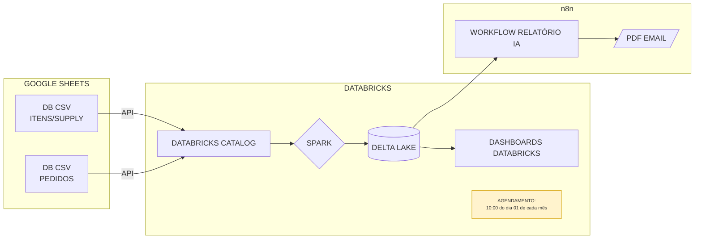

# 📊 Business Case - Dados (E-commerce B2C)

## 🌐 Contexto da Empresa
Somos um **e-commerce B2C em rápido crescimento**, com múltiplas categorias de produtos e uma operação logística robusta.  
Atualmente, enfrentamos desafios relacionados a **vendas, supply chain e logística**, e buscamos estruturar nossa área de dados para apoiar decisões estratégicas.

---

## 🎯 Objetivo do Case
O desafio consiste em realizar um **diagnóstico inicial das bases de dados** fornecidas (Pedidos, Itens dos Pedidos e Supply), gerando **insights estratégicos** que auxiliem a empresa a:

- Melhorar a **conversão de vendas**  
- Reduzir **rupturas de estoque**  
- Otimizar a **logística e prazos de entrega**  


---

## 🛠️ Tecnologias Utilizadas
- **Python** → Scripts de ETL e análises
- **PySpark** → Processamento de grandes volumes de dados
- **Google Sheets API** → extração de dados
- **Databricks** → Unity Catalog, Jobs, Notebooks, Delta Lake, Dashboards 
- **n8n** → automação (query → PDF → e‑mail)
- **GitHub** → Versionamento e colaboração

---

## 🧭 Visão Geral

- **Fonte**: duas bases em Google Sheets (Itens/Supply e Pedidos)
- **Ingestão**: via **API** para o **Databricks Catalog**
- **Processamento**: **Apache Spark** em job agendado
- **Persistência**: **Delta Lake** (tabelas versionadas)
- **Consumo**:
  - **Dashboards Databricks**
  - **n8n** → gera **PDF** e envia **e‑mail** (Relatório IA)

## 🗺️ Arquitetura



---

## 📂 Estrutura de Pastas 
```
Case/
├── dashboard_databricks/ 
│   ├── Dash_Gocase.lvdash.json       # dashboard databricks
│   └── Dashboard_Databricks.jpg      # print dashboard databricks
│
├── job_databricks/             
│   ├── Case_Gocase.json        # json com o job do databricks para reprodução.
│   └── job_databricks.jpg      # print job databricks
│    
├── workflow/                   
│   ├── workflow_n8n.json    # json workflow do n8n para reprodução.
│   └── workflow_n8n.jpg     # print workflow n8n
│  
├── analise.ipynb            # notebook com os codigos em pyspark para análise
├── ingestor.ipynb           # notebook com os codigos de extração csv
├── utils.py                 # funções python
├── Case_Gocase.drawio       # arquitetura
└── README.md

```

## 🚀 Como rodar

### 1) Ingestão (Google Sheets → CSV-Catalog)
- Execute o notebook `ingestor.ipynb` em um **cluster** databricks.

### 2) Análises (CSV-Catalog → Delta Lake)
- Execute `analise.ipynb `.

### 3) Agendamento (Monthly)
- Crie um **Job** agendado no Databricks com `job_databricks/Case_Gocase.json`. 

### 4) Dashboards
- Use o `Dash_Gocase.lvdash.json` no **Databricks** para gerar o dashboard.

### 5) n8n — Relatório IA (PDF → E‑mail)
- Importe `workflow/workflow_n8n.json` no n8n para criação do work flow.
- Configure as credenciais das APIs
---

## 📬 Contato
**Autor:** Emanoel Javier de Araujo Costa  
**GitHub:** https://github.com/EJavierCosta
