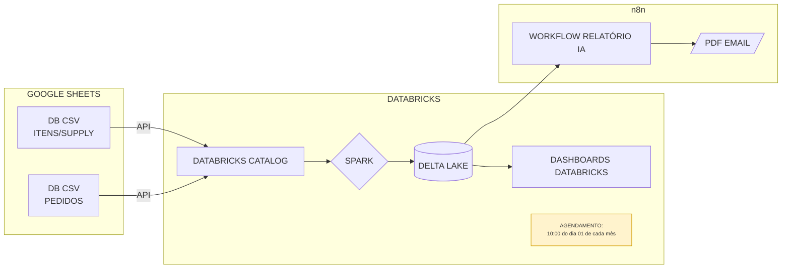

# 📊 Business Case - Dados (E-commerce B2C)

## 🌐 Contexto da Empresa
Somos um **e-commerce B2C em rápido crescimento**, com múltiplas categorias de produtos e uma operação logística robusta.  
Atualmente, enfrentamos desafios relacionados a **vendas, supply chain e logística**, e buscamos estruturar nossa área de dados para apoiar decisões estratégicas.

---

## 🎯 Objetivo do Case
O desafio consiste em realizar um **diagnóstico inicial das bases de dados** fornecidas (Pedidos, Itens dos Pedidos e Supply), gerando **insights estratégicos** que auxiliem a empresa a:

- Melhorar a **conversão de vendas**  
- Reduzir **rupturas de estoque**  
- Otimizar a **logística e prazos de entrega**  


---

## 🛠️ Tecnologias Utilizadas
- **Python** → Scripts de ETL e análises
- **PySpark** → Processamento de grandes volumes de dados
- **Google Sheets API** → extração de dados
- **Databricks** → Unity Catalog, Jobs, Notebooks, Delta Lake, Dashboards 
- **n8n** → automação (query → PDF → e‑mail)
- **GitHub** → Versionamento e colaboração

---

## 🧭 Visão Geral

- **Fonte**: duas bases em Google Sheets (Itens/Supply e Pedidos)
- **Ingestão**: via **API** para o **Databricks Catalog**
- **Processamento**: **Apache Spark** em job agendado
- **Persistência**: **Delta Lake** (tabelas versionadas)
- **Consumo**:
  - **Dashboards Databricks**
  - **n8n** → gera **PDF** e envia **e‑mail** (Relatório IA)

## 🗺️ Arquitetura



---

## 📂 Estrutura de Pastas 
```
Case/
├── notebooks/                  # Notebooks de ingestão e transformação
│   ├── 00_ingestao_google_sheets.py
│   ├── 10_transform_silver.py
│   └── 20_gold_metrics.sql
├── jobs/                       # Definições de jobs (JSON) p/ Databricks Jobs
│   └── monthly_job.json
├── sql/                        # Consultas usadas por dashboards/n8n
│   ├── dashboard_orders.sql
│   └── report_supply.sql
├── dashboards/                 # Export/descrição de painéis (Lakeview)
│   └── readme.md
├── n8n/                        # Workflow do n8n (export JSON) e templates
│   ├── workflow_relatorio_ia.json
│   └── templates/
├── docs/                       # Documentação extra (diagrama, dicionário de dados)
│   ├── architecture.mmd
│   └── data_dictionary.md
├── scripts/                    # Utilitários (ex.: carga inicial, testes locais)
│   └── bootstrap.sh
├── .env.example                # Variáveis de ambiente (para dev/local)
└── README.md
```

## 🚀 Como rodar

### 1) Ingestão (Google Sheets → Bronze)
- Execute o notebook `notebooks/00_ingestao_google_sheets.py` em um **cluster**.
- Parametrize com os IDs das planilhas e destino (`catalog.schema.tabela`).
- Saída esperada: tabelas `bronze_itens` e `bronze_pedidos` em Delta.

### 2) Transformações (Bronze → Silver/Gold)
- Execute `notebooks/10_transform_silver.py` e `20_gold_metrics.sql`.
- Cria tabelas/visualizações otimizadas para consumo por dashboards e n8n.

### 3) Agendamento (Monthly)
- Crie um **Job** no Databricks com **cron** `0 10 1 * *` (10:00, dia 1 de cada mês). 
- Encadeie as tarefas: `00_ingestao` → `10_transform` → `20_gold`.
- Defina **dependências** e **alertas** (notificações por e‑mail/Slack, se desejado).

### 4) Dashboards
- Publique consultas de `sql/` no **Databricks SQL** ou **Lakeview**.
- Conecte às tabelas Delta **gold**.

### 5) n8n — Relatório IA (PDF → E‑mail)
- Importe `n8n/workflow_relatorio_ia.json` no n8n.
- Configure credenciais de **Databricks SQL** (REST API) e **E‑mail** (SMTP/Provider).
- Ajuste o nó que consulta `sql/report_supply.sql` e `sql/dashboard_orders.sql`.
- Formate o conteúdo (Markdown/HTML) e gere PDF → **Enviar** para `REPORT_EMAIL_TO`.
- Opcional: acione o workflow via **Webhook** ou por **gatilho** ao término do Job no Databricks.

---

## 📬 Contato
**Autor:** Emanoel Javier de Araujo Costa  
**GitHub:** https://github.com/EJavierCosta
